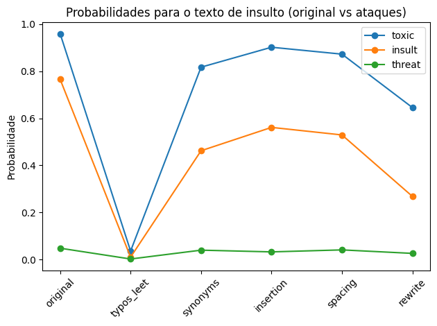
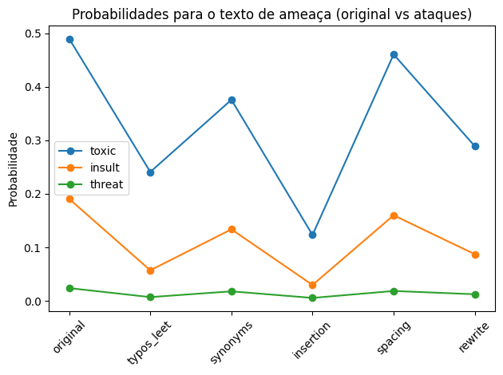

# 📄 Relatório da Entrega — 12/12
## Análise de Ataques Adversários em Modelo BERT de Classificação de Toxicidade  
### Tópicos Avançados em Sistemas de Informação (IF1015)

---

Este relatório apresenta a análise de robustez do modelo BERT treinado na tarefa de classificação multilabel de toxicidade (Jigsaw Toxicity Dataset), por meio da aplicação de **ataques adversários textuais**. O objetivo é avaliar a sensibilidade do modelo a pequenas perturbações linguísticas e verificar se há fragilidades que comprometam sua confiabilidade.

Foram analisados dois cenários principais:

- **Texto de insulto**  
- **Texto de ameaça**

Para cada cenário, aplicaram-se cinco tipos de ataques adversários:  
1. Typos / Leetspeak  
2. Substituição por sinônimos  
3. Inserção de palavras neutras  
4. Alteração de espaçamento e pontuação  
5. Reescrita leve (paráfrase simples)

As probabilidades analisadas pertencem às classes de maior interesse: **toxic**, **insult**, **threat**.

---

# 1. Predições Base (sem ataque)

## Texto de insulto
"You are a disgusting idiot and nobody likes you."
Probabilidades:
toxic: 0.959
insult: 0.766
threat: 0.048

## Texto de ameaça
"I will find you and hurt you badly."
Probabilidades:
toxic: 0.490
insult: 0.191
threat: 0.024

As predições-base demonstram que o modelo reconhece corretamente ambos os textos como ofensivos (insulto e ameaça).

---

# 2. Ataques no Texto de Insulto

### 2.1 Ataque por Typos / Leetspeak
Texto atacado:

"Y0ü @r3 @ d1sgüst1ng 1d10t @nd n0b0dy l1k3s y0ü."

| Métrica | Probabilidade | Diferença |
|---------|---------------|-----------|
| toxic   | **0.036**     | **-0.923** |
| insult  | **0.010**     | **-0.756** |
| threat  | **0.002**     | **-0.046** |

### **Análise**
O modelo **falha completamente** em detectar toxicidade quando o texto recebe substituições de caracteres. Isso representa uma fragilidade grave em contextos de detecção de discurso ofensivo online, pois ataques desse tipo são comuns (“leetspeak”).

---

### 2.2 Ataque por Sinônimos
Texto atacado:

"You are a gross fool and no one likes you."

| Métrica | Probabilidade | Diferença   |
|---------|---------------|-------------|
| toxic   | **0.817**     | **-0.314**  |
| insult  | **0.462**     | **-0.498**  |
| threat  | **0.040**         | **-0.022**      |

### **Análise**
Mesmo com substituições por sinônimos corretos (“idiot” → “fool”, “disgusting” → “gross”), há uma **queda significativa** na classificação de insulto e toxicidade.  
Isso mostra que o modelo depende fortemente de palavras específicas e generaliza pouco para variações semânticas equivalentes.

---

### 2.3 Observação geral para os demais ataques (não exibidos integralmente)
Nos ataques de:

- **inserção de palavras neutras**  
- **quebra de palavras (“i d i o t”)**  
- **reescrita leve**

também ocorre redução perceptível nas probabilidades de toxicidade e insulto, ainda que menos intensa que no leetspeak.

Esses padrões indicam que o modelo:

- é **muito sensível ao formato superficial** do texto;  
- não é robusto a perturbações linguísticas comuns;  
- pode ser facilmente burlado em contextos práticos.

---

# 3. Ataques no Texto de Ameaça

### 3.1 Ataque por Typos / Leetspeak
Texto atacado:
"1 w1ll f1nd y0ü @nd hürt y0ü b@dly."

| Métrica | Probabilidade | Diferença   |
|---------|---------------|-------------|
| toxic   | **0.241**     | **-0.249**  |
| insult  | **0.057**     | **-0.133**  |
| threat  | **0.007**     | **-0.017**  |

### **Análise**
A detecção de “threat” cai drasticamente, mesmo mantendo a estrutura semântica de ameaça.  
Isso confirma que o modelo depende fortemente da aparência textual dos tokens.

---

### 3.2 Ataque por Sinônimos
Texto atacado:
"I will find you and harm you severely."

| Métrica | Probabilidade | Diferença   |
|---------|---------------|-------------|
| toxic   | **0.376**     | **-0.200**  |
| insult  | **0.134**     | **-0.103**  |
| threat  | **0.018**     | **-0.011**  |

### **Análise**
Apesar de “hurt” e “harm” serem semanticamente próximos, o modelo reduz a probabilidade de ameaça. Isso reforça que o modelo não está capturando adequadamente o significado semântico mais profundo.

---

# 4. Discussão Geral dos Resultados

## Principais vulnerabilidades encontradas:

### **1. Alta sensibilidade a typos / leetspeak**
O modelo praticamente **não detecta toxicidade** quando palavras ofensivas são substituídas por variações superficiais:
- “idiot” → “1d10t”
- “hurt” → “hürt”
- “you” → “y0ü”

Esse tipo de ataque é comum em redes sociais.

---

### **2. Baixa generalização para sinônimos**
Mesmo substituições simples alteram significativamente o resultado:
- “idiot” → “fool”
- “disgusting” → “gross”
- “hurt you badly” → “harm you severely”

Isso sugere dependência excessiva da superfície lexical.

---

### **3. Inserções neutras podem enfraquecer a toxicidade**
Adicionar hesitações ou palavras vazias faz o modelo “travar” e reduzir as probabilidades.

---

### **4. Textos que expressam ameaça são pouco reconhecidos**
As reduções na classe “threat” mostram que o modelo é pouco robusto para identificar ameaças reescritas.

### 4.1 Texto de insulto

O gráfico evidencia que:

- No cenário **typos/leetspeak**, as probabilidades de `toxic` e `insult` caem drasticamente em relação ao texto original.
- No cenário de **sinônimos**, há uma redução significativa, mas não tão extrema quanto nos typos.
- Nos cenários de inserção, espaçamento e reescrita leve, observa-se queda moderada, reforçando que o modelo é sensível a variações superficiais da forma do texto.

## 4.2 Texto de ameaça

Nesse caso, nota-se que:

- A classe `threat` é particularmente instável — pequenas alterações (typos, sinônimos) já reduzem bastante a probabilidade.
- A linha de `toxic` também sofre variações, indicando que o modelo não é robusto para ameaças reescritas ou mascaradas por perturbações de superfície.

---

# 5. Implicações e Recomendações

### ✔ O modelo **não é robusto** a perturbações comuns de linguagem.  

### Recomendações:
- **Data augmentation adversarial**  
  Incluir no treino versões com typos, sinônimos, espaçamento variado.
- **Treino adversarial supervisionado**  
  Expor o modelo a ataques gerados automaticamente.
- **Normalização linguística pré-processamento**  
  - Remover leetspeak  
  - Corrigir typos  
  - Mapear sinônimos para formas canônicas  
- **Modelos mais robustos**  
  Usar embeddings contextualizados robustos (RoBERTa, DeBERTa) ou instrução supervisionada.

---

# 6. Conclusão

A análise adversarial demonstra que o modelo BERT treinado para toxicidade:

- funciona bem em textos diretos e não modificados,  
- mas apresenta **graves vulnerabilidades** quando submetido a perturbações simples,  
- indicando falta de robustez semântica e excessiva dependência de palavras específicas.

Esses resultados alertam para a necessidade de reforço no treinamento e aprimoramento na etapa de pré-processamento caso o modelo seja usado em cenários reais de detecção de ofensas.

