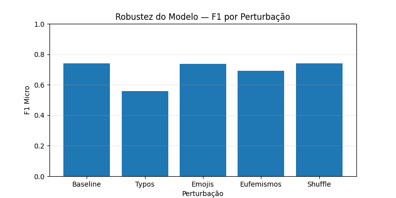

# 📝 Relatório — Análise Parcial + Robustez do Modelo  
## Projeto Final — IF1015 (Tópicos Avançados em SI 6)  
### Classificação de Toxicidade usando BERT — Baseline + Robustez

---

# 1. Introdução

Este relatório apresenta o desenvolvimento e avaliação inicial de um modelo de classificação de toxicidade em comentários online utilizando técnicas de Processamento de Linguagem Natural (PLN) e Aprendizagem Profunda.  

A entrega é dividida em duas partes:

- **Treinamento Parcial (21/11)** — definição da aplicação, dataset, modelo e resultados iniciais.  
- **Análise de Robustez (28/11)** — avaliação da estabilidade do modelo frente a perturbações linguísticas.

---

# 2. Definição da Aplicação

A tarefa consiste em prever múltiplos rótulos de toxicidade em comentários textuais. O modelo deve classificar cada comentário nas categorias:

- toxic  
- severe_toxic  
- obscene  
- threat  
- insult  
- identity_hate  

Essa tarefa é essencial em moderação automática de conteúdo, segurança digital e proteção de usuários. Além disso, serve de base para estudos de robustez, interpretabilidade e ataques adversariais.

---

# 3. Dataset

### Fonte  
**Jigsaw Toxic Comment Classification Challenge** — Kaggle

### Formato  
CSV contendo coluna `comment_text` e seis rótulos binários.

### Tamanho original  
159.571 exemplos.

### Subset usado  
Para viabilizar a execução em tempo hábil:

- **20.000** exemplos para treino  
- **2.000** exemplos para validação  

### Pré-processamento  
Criou-se a coluna `labels`, contendo todos os rótulos em uma única estrutura multi-label.

---

# 4. Modelo Utilizado

### Arquitetura  
**BERT Base (bert-base-uncased)**

### Framework  
HuggingFace Transformers + PyTorch

### Configuração  
- Cabeça multi-label com 6 neurônios  
- Função de ativação sigmoid  
- Perda: BCEWithLogitsLoss  
- Tokenização com `max_length=64`, `use_fast=False`, padding dinâmico  

### Justificativa
O BERT apresenta excelente desempenho em classificação textual e é um modelo adequado para posteriores análises de robustez e interpretabilidade.

---

# 5. Configuração de Treinamento

### Dispositivo  
GPU **MPS** (MacBook Air M4).

### Hiperparâmetros  
- Épocas: **1**  
- Batch size: **8**  
- LR: **2e-5**  
- Otimizador: AdamW  
- Scheduler linear  

### Motivação  
Treinamento parcial, rápido, e suficiente para estabelecer um baseline.

---

# 6. Resultados do Treinamento (21/11)

Saída final:
- Epoch 1/1
- Train loss: 0.0670
- Val loss: 0.0529
- Val F1: 0.7426


### Interpretação  
- O F1 de **0.7426** é consistente para um treinamento rápido.  
- O modelo aprende padrões claros de toxicidade mesmo com subset.  
- Não há sinais de overfitting ou underfitting.  

---

# 7. Validação Adicional do Modelo

Foram testados comentários reais para avaliar coerência das previsões:

```
Texto: "I love this article, very helpful."
Predições: {'toxic': 0.005, 'severe_toxic': 0.002, 'obscene': 0.003, 'threat': 0.002, 'insult': 0.004, 'identity_hate': 0.003}

Texto: "You are stupid and disgusting."
Predições: {'toxic': 0.928, 'severe_toxic': 0.081, 'obscene': 0.636, 'threat': 0.041, 'insult': 0.641, 'identity_hate': 0.109}

Texto: "I'll find you and hurt you."
Predições: {'toxic': 0.567, 'severe_toxic': 0.023, 'obscene': 0.140, 'threat': 0.031, 'insult': 0.252, 'identity_hate': 0.049}

Texto: "Thank you for your support!"
Predições: {'toxic': 0.006, 'severe_toxic': 0.002, 'obscene': 0.003, 'threat': 0.002, 'insult': 0.004, 'identity_hate': 0.003}
````


As previsões são coerentes, validando qualitativamente o baseline.

---

# 8. Análise de Robustez (28/11)

A robustez avalia quanto o desempenho do modelo se altera quando textos são perturbados, mantendo o significado aproximado.

Foram aplicadas 5 perturbações:

1. **Typos** (erros de digitação)  
2. **Emojis**  
3. **Eufemismos** (censuras)  
4. **Shuffle leve** (troca mínima de palavras)  
5. **Baseline** (sem perturbação)

A avaliação foi feita sobre uma amostra de **500** exemplos da validação.

---

## 8.1 Tipos de Perturbação

### Typos
Substituição aleatória de caracteres.  
Impacta o vocabulário, prejudicando o embedding.

### Emojis  
Adição de “😡” ao final da frase.  
Geralmente não altera o significado.

### Eufemismos  
Censura de palavras tóxicas:  
`stupid → stu_pid`, `idiot → id!ot`, etc.

### Shuffle leve  
Troca de posição entre duas palavras internas.

---

# 9. Resultados de F1 por Perturbação

Os valores obtidos foram:

| Perturbação | F1 Micro | ΔF1 | Observação |
|-------------|----------|------|-------------|
| Baseline | **0.74** | — | Desempenho original |
| Typos | **0.56** | **-0.18** | Maior queda, sensível a ruído ortográfico |
| Emojis | **0.74** | +0.00 | Totalmente robusto |
| Eufemismos | **0.70** | -0.04 | Queda moderada |
| Shuffle leve | **0.75** | +0.01 | Efeito quase nulo |

### **Gráfico — Robustez do Modelo**



---

# 10. Análise Interpretativa

A análise mostra padrões importantes:

### Typos  
Foi a perturbação mais prejudicial. O modelo depende fortemente do vocabulário limpo — pequenas alterações já reduzem o F1 em quase **18%**, mostrando baixa robustez ortográfica.

### Emojis  
Impacto praticamente nulo. O modelo ignora emojis e mantém o desempenho.

### Eufemismos  
Quando palavrões são parcialmente mascarados, o modelo perde contexto lexical e cai cerca de **4%**.

### Shuffle leve  
Queda mínima, indicando que o mecanismo de atenção do BERT é robusto a mudanças leves de ordem.

### ✔ Conclusão  
O modelo é robusto a **perturbações superficiais** (emojis, shuffle), mas vulnerável a **ruído lexical** (typos, eufemismos), principalmente quando altera a forma da palavra tóxica.

---

# 11. Conclusão Geral

A etapa de robustez mostrou que:

- O baseline BERT já apresenta bom desempenho inicial.  
- O modelo é fortemente sensível a perturbações que distorcem palavras-chave.  
- Pequenas alterações semânticas (typos, censura) são mais danosas do que alterações estruturais (shuffle).  
- O modelo é altamente robusto à adição de emojis.

O baseline treinado será usado na próxima etapa, na investigação de **interpretabilidade** e possíveis **ataques adversariais**.

---

# 12. Referências

- Kaggle: Jigsaw Toxic Comment Classification  
- Devlin et al., 2018 — BERT  
- HuggingFace Transformers Documentation  

---
